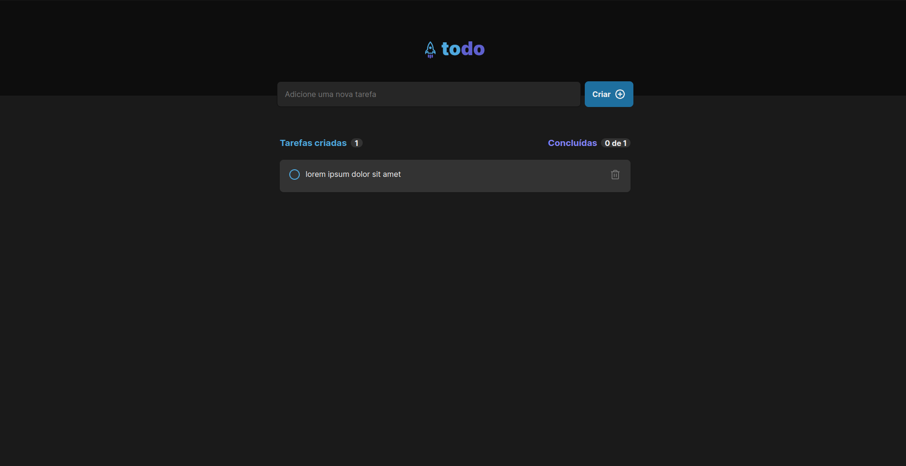

   

# Ignite ToDo

It's a simple application that you can add new tasks and mark as completed, this application was create to improve my knowledge about React and CSS

# How to run

1 Clone the repository into your machine.

2 You will need NodeJS/ NPM to run, you can download [here](https://nodejs.org/en).

3 Execute `npm run dev`.

4 Open into you Browser the address: ``http://localhost:5173``.

# Features

- [x] Create a new task.
- [x] Mark task as completed.
- [x] Delete Task.
- [x] Show total of created tasks.
- [x] Show the number of completed task on top of created tasks

# Preview

